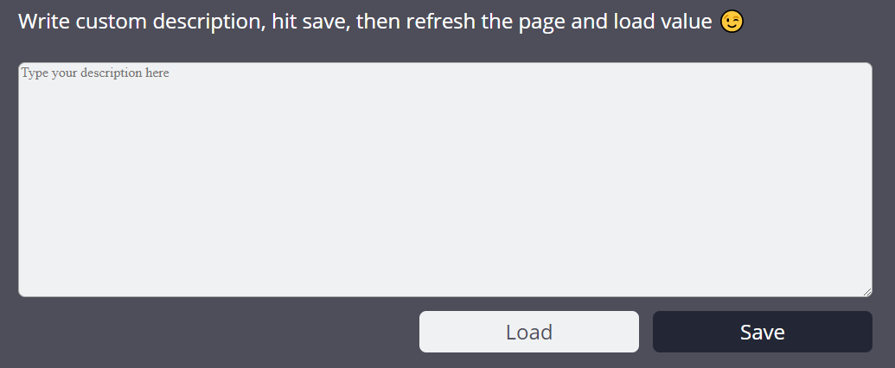

# Simple editor
Small app created during ["WTF: Co ten frontend?"](https://cotenfrontend.pl/) course, to test web browser's local storage.

## Screenshots

## How to run app?
Just visit this [website](https://raviraven.github.io/html-simple-editor-local-storage/), and type some description you want to save for the future. Refresh the page and click on "Load" button. That's that simple! 😉

## How does it work? 
Everything is handled in JS.  
When you click on "save" button, js take textarea value, and save it into local storage. Then, when you refresh the page, you can still access local storage using "Load" button.  

Local storage, opposite to session storage, keeps value until you remove it manually.